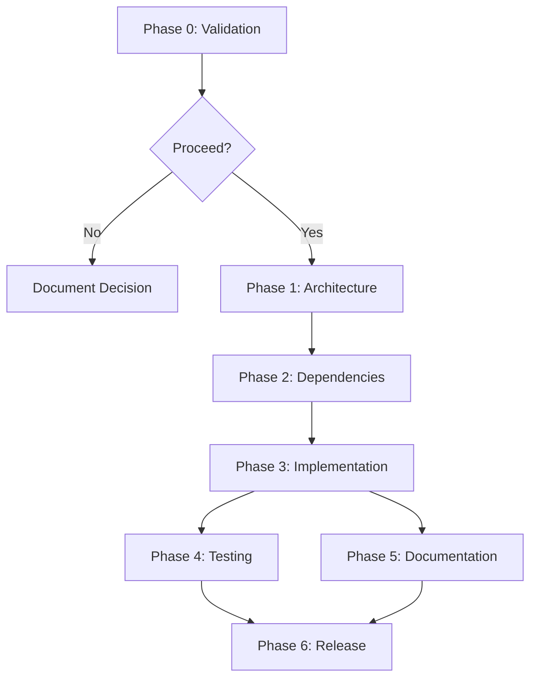

# Implementation Plan: List Files in Current Directory

## Executive Summary

**Status**: NOT RECOMMENDED FOR IMPLEMENTATION

This implementation plan documents why this feature should not be implemented in dynamodb-tools, and provides alternatives if file listing functionality is genuinely needed.

## Prerequisites

### If Implementation Were Required (Not Recommended)

- [ ] Stakeholder approval for scope expansion
- [ ] Justification for why standard tools are insufficient
- [ ] Decision on binary vs library architecture
- [ ] Dependency audit approval for new crates

### Current State

- [x] Library is feature-complete for DynamoDB utilities
- [x] Project scope is well-defined in CLAUDE.md
- [x] No user requests for file system utilities
- [x] Standard tools (`ls`, `find`) are available

## Implementation Steps (Hypothetical)

### Phase 0: Validation (Required Before Any Work)

1. **Confirm Requirements**
   - Verify this is an actual feature request, not a misunderstanding
   - Identify the real user need behind the request
   - Explore if existing tools meet the need
   - **Decision Point**: Proceed only if justified

2. **Scope Definition**
   - Define exact file listing requirements
   - Determine if recursive listing is needed
   - Specify output format requirements
   - Identify filtering/sorting needs

### Phase 1: Architecture Decision (If Proceeding)

**Step 1.1: Choose Architecture Pattern**

Option A: Separate Binary Crate
```toml
# Cargo.toml
[[bin]]
name = "dynamo-tools-cli"
path = "src/bin/main.rs"
required-features = ["cli"]
```

Option B: Workspace with Multiple Crates
```
dynamodb-tools/
├── dynamodb-tools/        # Core library
├── dynamodb-tools-cli/    # CLI utilities
└── Cargo.toml             # Workspace config
```

**Recommendation**: Option B (workspace) to maintain separation

**Step 1.2: Update Project Structure**
- Create workspace Cargo.toml
- Separate core library from CLI
- Update CI/CD pipeline
- Update documentation

**Dependencies**: None
**Verification**: Cargo build succeeds with workspace structure

### Phase 2: Add Dependencies (If Proceeding)

**Step 2.1: Add CLI Dependencies**

```toml
# dynamodb-tools-cli/Cargo.toml
[dependencies]
clap = { version = "4.5", features = ["derive"] }
walkdir = "2.5"
ignore = "0.4"  # Respects .gitignore
colored = "2.1"
```

**Step 2.2: Run Cargo Deny**
```bash
cargo deny check
```

**Dependencies**: Architecture decision (Phase 1)
**Verification**: No security advisories, license compliance

### Phase 3: Implement Core Functionality (If Proceeding)

**Step 3.1: Create CLI Entry Point**

```rust
// src/bin/main.rs
use clap::Parser;

#[derive(Parser)]
#[command(name = "dynamo-tools")]
#[command(about = "DynamoDB tools CLI utilities")]
struct Cli {
    #[command(subcommand)]
    command: Commands,
}

#[derive(Subcommand)]
enum Commands {
    ListFiles(ListFilesArgs),
    // Other DynamoDB-related commands
}
```

**Step 3.2: Implement File Listing Logic**

```rust
// src/bin/list_files.rs
use walkdir::WalkDir;

pub fn list_files(args: &ListFilesArgs) -> anyhow::Result<()> {
    for entry in WalkDir::new(&args.path) {
        let entry = entry?;
        println!("{}", entry.path().display());
    }
    Ok(())
}
```

**Dependencies**: Phase 2 (dependencies added)
**Verification**: Manual testing with test directory

### Phase 4: Testing (If Proceeding)

**Step 4.1: Add Unit Tests**

```rust
#[cfg(test)]
mod tests {
    use super::*;
    use tempfile::TempDir;

    #[test]
    fn test_list_files_empty_dir() -> anyhow::Result<()> {
        let temp = TempDir::new()?;
        // Test implementation
        Ok(())
    }
}
```

**Step 4.2: Add Integration Tests**

Create `tests/cli_integration_test.rs` for end-to-end CLI testing.

**Dependencies**: Phase 3 (implementation complete)
**Verification**: All tests pass

### Phase 5: Documentation (If Proceeding)

**Step 5.1: Update README**
- Add CLI usage section
- Document installation of binary
- Provide examples

**Step 5.2: Add CLI Help Text**
```rust
#[derive(Parser)]
#[command(about = "List files in directory")]
struct ListFilesArgs {
    #[arg(default_value = ".")]
    path: String,
}
```

**Dependencies**: Phase 3 (implementation complete)
**Verification**: `cargo run --bin dynamo-tools-cli -- --help` works

## Dependencies Between Steps



## Verification Checkpoints

### Checkpoint 1: After Phase 0
- [ ] Confirmed feature is needed
- [ ] Identified specific use case
- [ ] Verified no existing tools meet the need
- [ ] **GO/NO-GO Decision**

### Checkpoint 2: After Phase 1
- [ ] Architecture decision documented
- [ ] Workspace structure created (if applicable)
- [ ] Cargo build succeeds

### Checkpoint 3: After Phase 2
- [ ] Dependencies added
- [ ] cargo deny check passes
- [ ] No license conflicts

### Checkpoint 4: After Phase 3
- [ ] Implementation complete
- [ ] Manual testing passed
- [ ] Code follows Rust conventions

### Checkpoint 5: After Phase 4
- [ ] All unit tests pass
- [ ] All integration tests pass
- [ ] Test coverage adequate

### Checkpoint 6: After Phase 5
- [ ] Documentation complete
- [ ] Examples verified
- [ ] CLI help text clear

## Recommended Approach: DO NOT IMPLEMENT

### Rationale

1. **Out of Scope**: File listing is not related to DynamoDB utilities
2. **Tool Redundancy**: Standard tools already exist (ls, find, fd, tree)
3. **Maintenance Burden**: Adds complexity without value
4. **User Confusion**: Dilutes library purpose

### Alternative Solutions

#### For Project Structure Documentation
```bash
tree -L 2 -I target
```

#### For Finding Rust Files
```bash
fd -e rs
```

#### For Detailed Listing
```bash
exa -la --tree
```

#### For Git-Aware Listing
```bash
git ls-files
```

## Conclusion

This implementation plan documents the steps that would be required if this feature were to be implemented. However, **the strong recommendation is to NOT implement this feature** and instead:

1. Use existing command-line tools for file listing
2. Maintain dynamodb-tools' focused scope on DynamoDB utilities
3. Document project structure in README if navigation help is needed

If file system utilities are genuinely needed for a DynamoDB-related workflow, that specific use case should be documented and evaluated separately.
